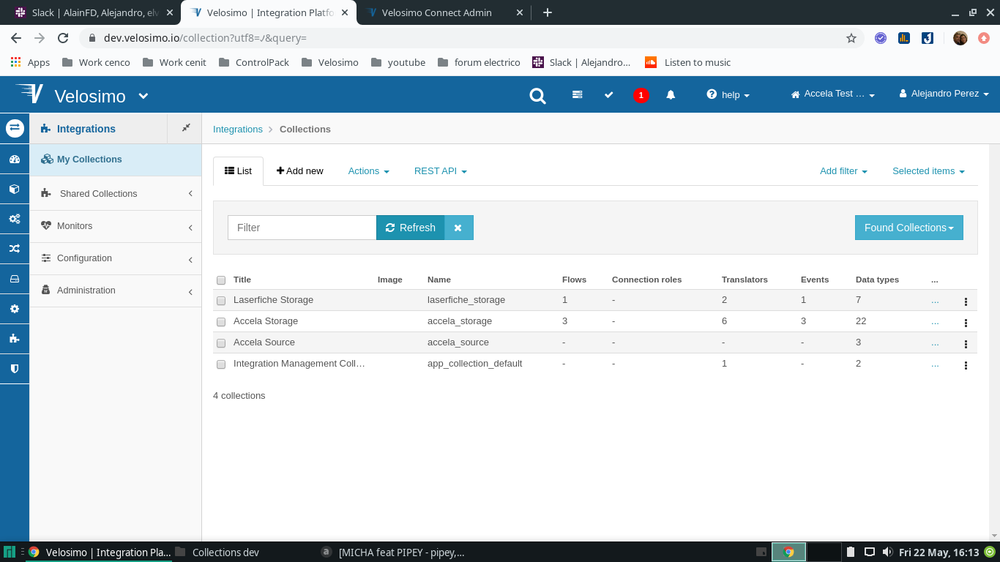

# Integration Accela Laserfiche

## [Create Tenant](createTenant)

## [Import Collection Accela Source](accelaSource)

## [Import Collection Accela Storage](accelaStorage)

## Import collections Laserfiche

### Collections for App

- Import collection Integration Management Collection for the new tenant (https://dev.velosimo.io/collection/pull_import)

- go to **_Integrations Collections_** (https://dev.velosimo.io/collection) and verify under Title **_Laserfiche Storage_** if exist **_laserfiche storage_** name

- To verify the correct import of the collection go to the browser and paste the url of your new application, verifying that the image is similar to these

### Authorization

- go to **_Security Authorizations OAuth 2.0 AuthorizationsAccela Storage | Accela_** (https://dev.velosimo.io/setup~oauth2_authorization) and check if under namespace **_Laerfiche Storage_** exist the **_laserfiche_** name

- go to option **_SecurityAuthorizationsBasic authorizationsLaserfiche Storage | LaserficheEdit _** and verify the current values with this:

> 1.  "namespace": "Laserfiche Storage",
> 2.  "name": "Laserfiche"

