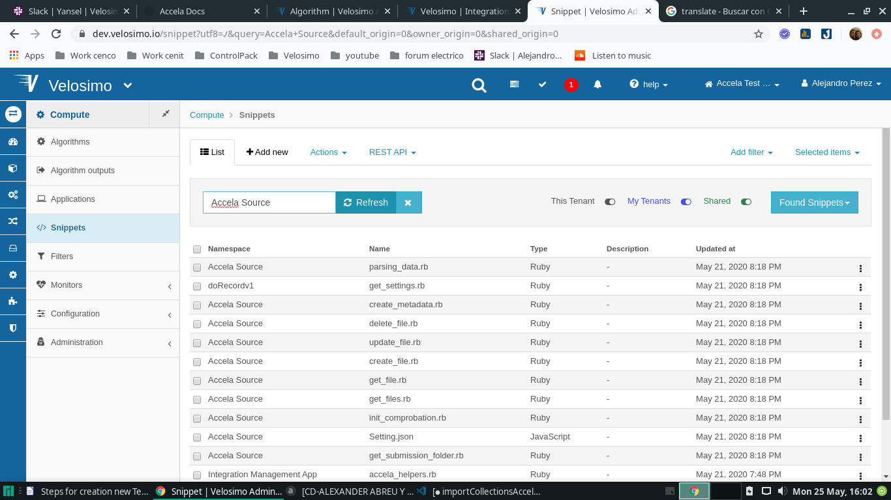

## Accela Source Collection

### Collections for App

- Import collection Accela Source for the new tenant (https://dev.velosimo.io/collection/pull_import)
  

### Regist Application for Adapter

- go to **_Dashboard Authorization ClientsOAuth ClientsApplicationsDoRecordv1 | Accela Adapter_** Regist for create slug for adapter

- Insert slug and OuthName for new tenant

- Click on the register button and verify that the slug was inserted

### Data Types

> This data types represent the intermediate data structure where the information coming from or destined for the platform to be integrated will be stored.

> It is very important that the data types described below be create with the exact same name assigned here.

- go to **_Definitions Data TypesJSON Types_** and verify under the namespace Accela Source if exist Object_type_map Data Type


- create 9 new records for Data*type Object*type_maps of namespace “Accela Source”
  (https://dev.velosimo.io/accela_source~object_type_map) with key and values

##### ** Key Value **

```
 1.  CAP -> Record
 2.  LICENSEPROFESSIONAL -> Professional
 3.  TMP_CAP -> Temp Record
 4.  PARCEL -> Parcel
 5.  INSPECTION -> Inspection
 6.  PART -> Part
 7.  EVIDENCE -> Evidence
 8.  ASSET -> Asset
 9.  ASSETCA -> Asset CA
```


- go to **_Definitions Data TypesJSON Types_** and verify under the namespace Accela Source if exist **_Settings_** Data Type , from it the initial information is obtained


### Verify Algorithms

> In these algorithms, are implemented the configuration and logic of information exchange, to send or request the information to or from the platform to be integrate, consuming the webhooks defined for this integration.

- go to **_ComputeAlgorithms_** and verify under the namespace Accela Source if exist 9 algorithms


#### Algorithm Get_settings

> The main function of the gett_settings algorithm is to obtain and send to the adapter the elements > necessary for its work, such as credentials, mapping, urls, etc., so it is important to verify if all the algorithms and data types used by this exist.

- go to **_ComputeAlgorithms_** and verify under the namespace doRecordv1 if exist **_algorithm get setings_** , this is necesary for work with accela Adapter


##### Code Algorithms Get Settings

```Tenant.notify(message: "EDMS Running initial checks", type: :info)
begin
response = {}
data={}
settings={}
credentials={}
 mappings={}

response['StatusCode'] = 200
response['StatusDescription'] = 'success'
 response['Data']=data

data['settings']=settings
data['credentials']=credentials
data['mappings']=mappings

#Getting the record of velosimo
record = Cenit.namespace('Accela Source').data_type('Setting').where(setting_id: 'GLOBAL').first

unless record.nil?

    #Checkng if the storage name is googledrive
    if params['storage'].eql?('googledrive')
      params['storage'] ='google_drive'
    end

    #Checkng if the storage integration is active, if not, no files will be stored
    if record['configuration'][params['storage']].present? && record['configuration'][params['storage']]['enable_save']

      #Getting namespace and name of an storage for obtain connection and authorization and endpoint
      name_storage=params['storage'].split("_").map{|name| name.capitalize}.join(" ")

      #Getting connection and authorization for storage selected
      connection = Setup::Connection.where(namespace: name_storage + ' Storage', name: 'Connection').first
      authorization= Setup::Authorization.where('namespace': name_storage + ' Storage', 'name': name_storage).first
      endpoint=Cenit.namespace(name_storage + ' Storage')

      unless params['storage'].eql?('velosimo')

        #getting credential for a storage and asking for storage
        if(params['storage'].eql?('laserfiche') || params['storage'].eql?('ftp'))
          credentials['username']=authorization.username
          credentials['password']=authorization.password
         else
          credentials['access_token']=authorization.access_token
          credentials['refresh_token']=authorization.refresh_token
         end

        #Obtain method for create URL,server, repository and license for laserfiche
        if params['storage'].eql?('laserfiche')

          #Obtain method for create URL
          if params['method'].eql?('Create File')
            params['method']='Get Files'
          end
          settings['url']=connection.url.sub("{{api_url}}",connection.template_parameters[3].value) << endpoint.resource(params['method']).path

          #Getting credential for storage laserfiche (server, repository and license)
          credentials['server']=connection.template_parameters[0].value
          credentials['repository']=connection.template_parameters[1].value
          credentials['license'] = connection.template_parameters.where(key: 'license').first['value']
        end

        #Obtain method for create URL for !!!FTP!!!!
        if(params['storage'].eql?('ftp'))
          credentials['server']=connection.template_parameters[0].value
          settings['url']=connection.url.sub("{{server}}",credentials['server'])<< endpoint.resource(params['method']).path
        end

         #Obtain method for create URL for !!!GOOGLE DRIVE!!!!
        if( params['storage'].eql?('google_drive') )
          if params['method'].eql?('Delete File') || params['method'].eql?('Get File')
             params['method']='Files'
          end

          if params['method'].eql?('Get Files') || params['method'].eql?('Create File')
            params['method']='Search for files and folders'
          end
          settings['url']=connection.url << endpoint.resource(params['method']).path
        end

         #Obtain method for create URL for !!!SHAREPOINT!!!!
        if params['storage'].eql?('sharepoint')
          if params['method'].eql?('Create File')
            params['method']='Get Files'
          end
          settings['url']="https://" << connection.template_parameters[0].value << endpoint.resource(params['method']).path.sub("{{site_folder}}/{{folder_name}}","Shared Documents")
        end

        #Obtain params for Accela
        configuration = record['configuration'][params['storage']]

        #Getting object_value and object_type for algorithm submision Folder
        params['settings'] = configuration
        params['object_value']=JSON.parse(params['keys'])[2]
        params['object_type']=JSON.parse(params['keys'])[1]

        #Calculating the target folder and Obtain Data for Accela
        submission_response = get_submission_folder(params)

        if submission_response['StatusCode'].eql?(200)

          #getting path for a storage and adding recorId
          params['record_id']= params['object_value']
          recordID = Cenit.namespace('Accela Storage').algorithm('get_cap_record').run(params)
          settings['path']= submission_response['Data']['folder'].sub("//","/") << recordID['Data']['customId'] << "/"

          if( params['storage'].eql?('sharepoint') )
            settings['url']= "https://" << connection.template_parameters[0].value << endpoint.resource(params['method']).path.sub("{{site_folder}}/{{folder_name}}","Shared Documents" << settings['path'])
          end

          #Getting data if storage is google_drive
          if( params['storage'].eql?('google_drive') )
            #Getting parent for storage is google_drive
            params['folder_path']=settings['path']
            params['create_folder']=settings['path']
            checking_folder = endpoint.algorithm('checking_folder').run(params)
            if checking_folder['StatusCode'].eql?(200)
              settings['parent']= checking_folder['Data']
            end
          end

          #Obtain Configuration for accela objects in laserfiche
          if params['storage'].eql?('laserfiche') && configuration['accela_objects'].present? && configuration['accela_objects'][params['object_type']].present?
            configuration = configuration['accela_objects'][params['object_type']]

            #Getting the mapping info if they are active
            if configuration['save_mappings'] and !configuration['mappings'].empty?
              file={}
              file['record']=record.to_json
              file['mapping_template']= configuration['mapping_template']
              file['mappings']=configuration['mappings']
              accela_mapping = endpoint.algorithm('accela_mapping').run(file)
              #Getting data for mapping
              mappings['templateId']=accela_mapping['templateId']
              mappings['templateName']=accela_mapping['templateName']
              mappings['templateFields']=accela_mapping['templateFields']
            end
          else
            if(params['storage'].eql?('laserfiche') )
            response['StatusCode'] = 401
            response['StatusDescription'] = "Configuration Error: There are not configurations stored for #{params['object_type']} in #{params['storage']} storage"
            end
          end
        end

      else
        response['StatusCode'] = 401
        response['StatusDescription'] = "Configuration Error: There are not configurations stored for #{params['storage']}"
      end
    else
      response['StatusCode'] = 401
      response['StatusDescription'] = "Configuration Error: The #{params['storage']} integration is not enable."
    end

else
response['StatusCode'] = 404
response['StatusDescription'] = "Configuration error: There are no configurations for the following storage: #{params['storage']}."
end
rescue StandardError => ex
Tenant.notify(message: "Error executing initial EDMS comprobations: #{ex.message}")
response.to_json
else
response.to_json
end
```

### Verify Snippets

 
