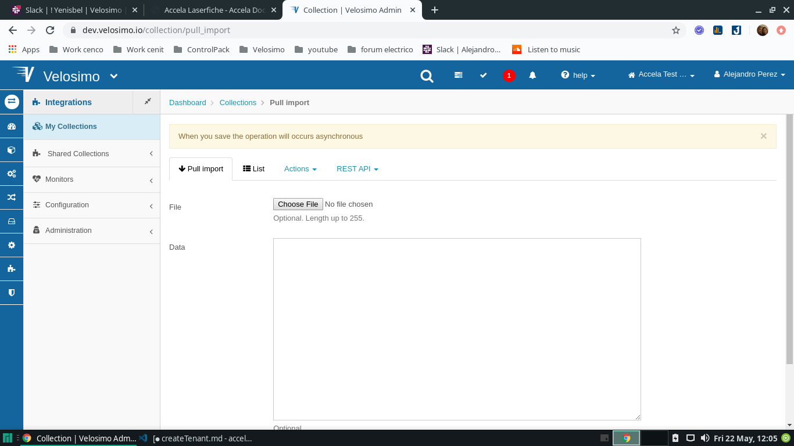
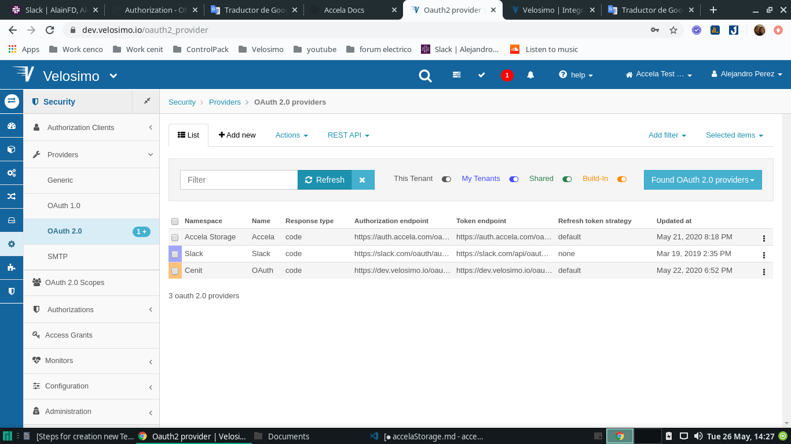

## Accela Storage Collection

### Collections for App

- Import collection Accela Source for the new tenant (https://dev.velosimo.io/collection/pull_import)
  

### Providers

- go to **_Security Providers OAuth 2.0 providers_** (https://dev.velosimo.io/oauth2_provider) and check if under namespace Accela Storage exist the accela Provider

 

- go to option **_edit_** and verify the value with this:

```
 1. "namespace": "Accela Storage",

 2. "name": "Accela",

 3. "authorization_endpoint": "https://auth.accela.com/oauth2/authorize",

 4. "\_type": "Setup::Oauth2Provider",

 5. "response_type": "code",

 6. "token_endpoint": "https://auth.accela.com/oauth2/token",

 7. "token_method": "POST",

 8. "refresh_token_strategy": "default"
```

### Authorizathions Clients

- go to **_Security Authorization ClientsRemote OAuth Clients_** (https://connect.velosimo.com/remote_oauth_client) and check if under provider **_Accela Storage | Accela_** exist the **_accela_** name


- go to option **_SecurityAuthorization ClientsRemote OAuth ClientsAccela Storage | Accela | AccelaEdit_** and verify the current values with this:

```
1. "name": "Accela",

2. "\_type": "Setup::RemoteOauthClient",

3. "identifier": "636619531026735366",

4. "secret": "70de5fab2ad34b21adcabd7dc811ee8b",

5. provider":
  - "namespace": "Accela Storage",
  - "name": "Accela"
```

### Scopes

- go to **_ SecurityOAuth 2.0 Scopes_** (https://dev.velosimo.io/oauth2_scope) and check if under namespace **_Accela Storage_** exist 10 scopes with the next values:

```
 1. "name": "run_emse_script",
 2. "name": "documents",
 3. "name": "records",
 4. "name": "professionals",
 5. "name": "parcels",
 6. "name": "contacts",
 7. "name": "inspections",
 8. "name": "addresses",
 9. "name": "assets",
10. "name": " settings",
```


### Authorization

- go to **_Security Authorizations OAuth 2.0 AuthorizationsAccela Storage | Accela_** (https://dev.velosimo.io/setup~oauth2_authorization) and check if under namespace **_Accela Storage_** exist the **_accela_** name


- go to option **_SecurityAuthorization ClientsRemote OAuth ClientsAccela Storage | Accela | AccelaEdit _** and verify the current values with this:

```
1. "namespace": "Accela Storage",

2. "name": "Accela",

3. "client":
 "name": "Accela",
 "\_type": "Setup::RemoteOauthClient",

4. scopes:
 - "name": "run_emse_script",
 - "name": "documents",
 - "name": "records",
 - "name": "professionals",
 - "name": "parcels",
 - "name": "contacts",
 - "name": "inspections",
 - "name": "addresses",
 - "name": "assets",
 - "name": " settings",
```

### Connections

- go to option **_Connectors Connections_** (https://dev.velosimo.io/connection) and check if under namespace **_Accela Storage_** exist the **_connection_** name, if it does not exist, it must be created with the values written in the next point, for this go to **_Connectors Connections New_** (https://dev.velosimo.io/connection/new)

- go to option **_ConnectorsConnectionsAccela Storage | ConnectionEdit_** and verify the current values with this:

```
  1. "namespace": "Accela Storage",

  2. "name": "Connection",

  3. "url": "https://apis.accela.com",

  4. "authorization":
    - "namespace": "Accela Storage",
    - "name": "Accela"

  5."headers":
     - "key": "Authorization",
     - "value": "{{access_token}}"
```
