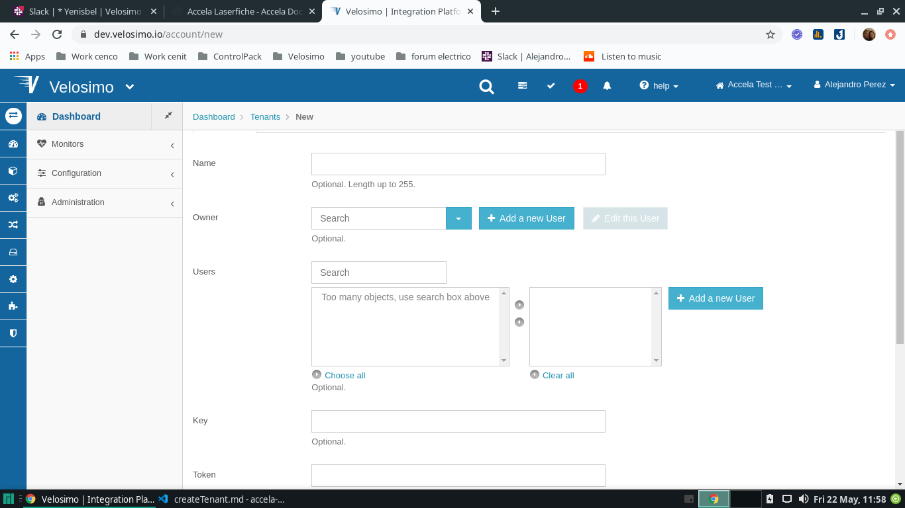
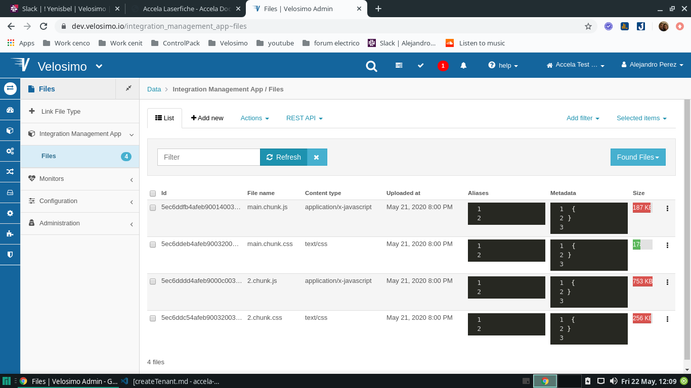
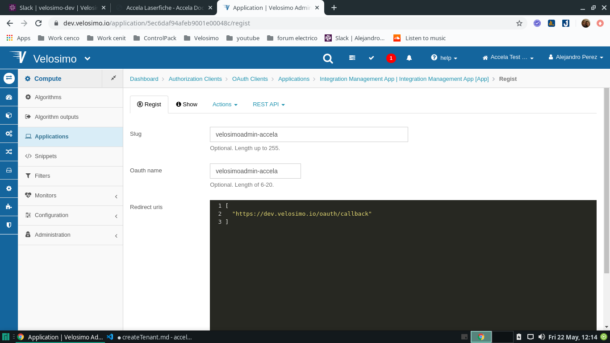

# Creation Tenant

## Create Tenant

• go to https://dev.velosimo.io/account/new

• Insert Name, Select Owner, adding user for new tenant, select notification level and time zone

## Collections for App

• Import collection Integration Management Collection for the new tenant (https://dev.velosimo.io/collection/pull_import)

## Import files for App

• Impor 4 new files for Integration Management Collection (https://dev.velosimo.io/integration_management_app~files)

1.  main.chunk.css
2.  2.chunk.css
3.  main.chunk.js
4.  2.chunk.js

## Regist new Aplicacion

• go to https://dev.velosimo.io/application/5ec6daf94afeb9001e00048c/regist

• Insert slug and OuthName for new tenant

•Click on the register button and verify that the spa is shown in the in the inserted slug (https://dev.velosimo.io/app/slug inserted)

## Create New Record for Accela

• go to DataIntegration Management App / Settings (https://dev.velosimo.io/integration_management_app~settings) and verify if Setting Data type under namespace exist

• create new record for Data_type Object_type_maps of namespace “Accela Source”
"http://connect.velosimo.com:3080/AccelaDocument.svc"

