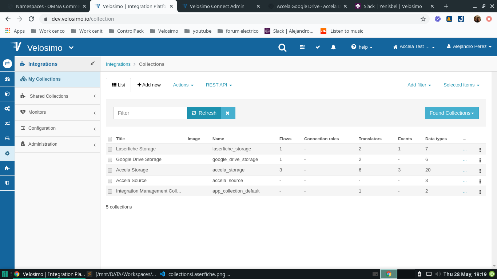
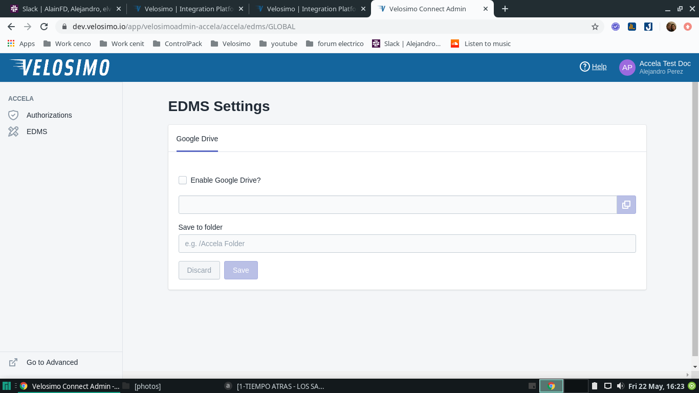
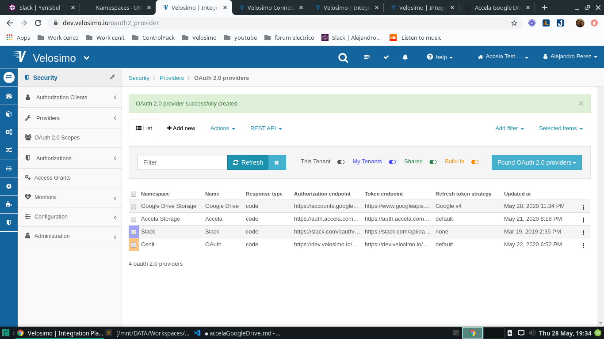
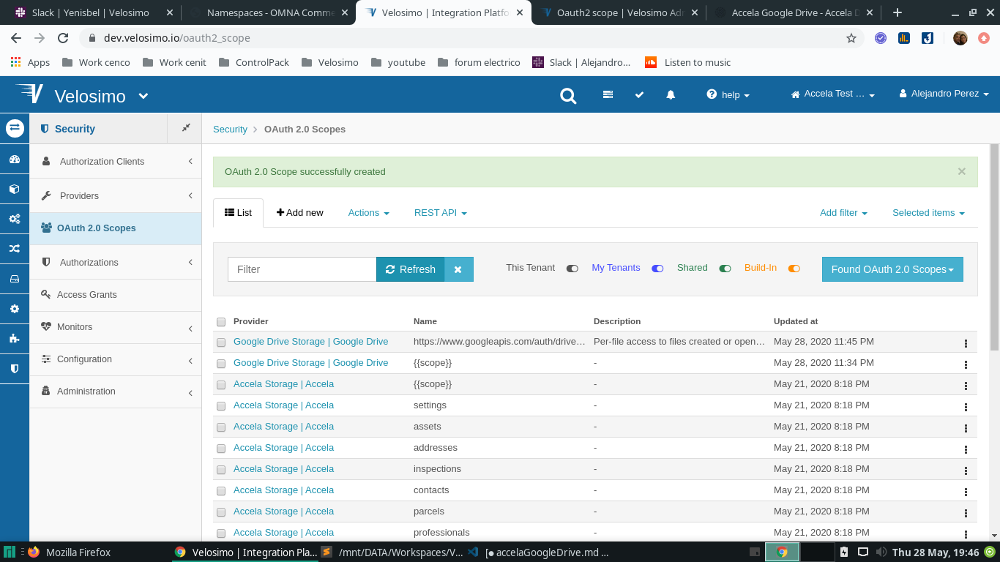
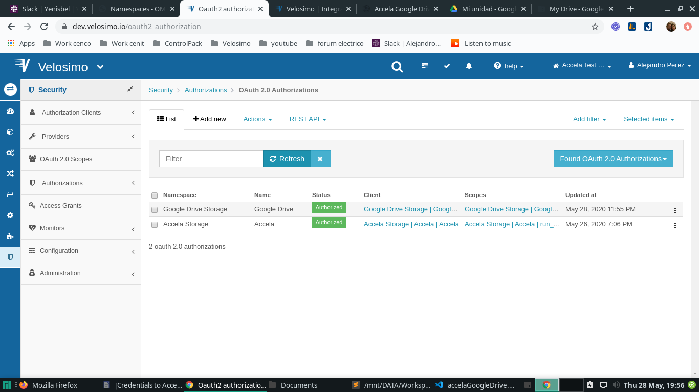
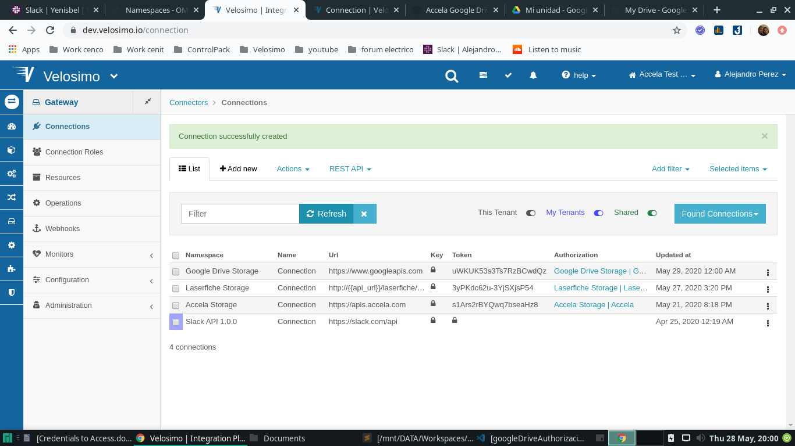

### Collections for App

- Import collection Integration Management Collection for the new tenant (https://dev.velosimo.io/collection/pull_import)


- go to **_Integrations Collections_** (https://dev.velosimo.io/collection) and verify under Title **_Google Drive Storage_** if exist **_google drive storage_** name, if it does not exist, it must be created with the values written in the next point



- To verify the correct import of the collection go to the browser and paste the url of your new application, verifying that the image is similar to these



### Provider

- go to **_SecurityProvidersOAuth 2.0 providers_** and check if under provider **_Google Drive Storage_** exist the **_Google Drive_** name , if it does not exist, it must be created with the values written in the next point



```
  1. "namespace": "Google Drive Storage",

  2. "name": "Google Drive",

  3. "authorization_endpoint": "https://accounts.google.com/o/oauth2/v2/auth",

  4. "_type": "Setup::Oauth2Provider",

  5. "response_type": "code",

  6. "token_endpoint": "https://www.googleapis.com/oauth2/v4/token",

  7. "token_method": "POST",

  8. "refresh_token_strategy": "Google v4"
```

### Client

- go to **_SecurityAuthorization ClientsRemote OAuth Clients_** (https://dev.velosimo.io/remote_oauth_client) and check if under provider **_Google Drive Storage_** exist the **_Google Drive_** name , if it does not exist, it must be created with the values written in the next point


```
  1. "name": "Google Drive",
  2. "_type": "Setup::RemoteOauthClient",
  3. "identifier": "647189529082-1b80852oajcdtkffpjtg34poi1tn0c8v.apps.googleusercontent.com",
  4. "secret": "l09he1mPuVXit51FQfDKewnf",
  5. "provider":
        - "namespace": "Google Drive Storage",
        - "name": "Google Drive"
```

### Scopes

- go to **_SecurityOAuth 2.0 Scopes_** (https://dev.velosimo.io/oauth2_scope) and check if under provider **_Google Drive Storage_** exist the **_Google Drive_** name , if it does not exist, it must be created with the values written in the next point



```
 1. "name": "https://www.googleapis.com/auth/drive.file",
 2. "description": "Per-file access to files created or opened by the app. File authorization is                          granted on a per-user basis and is revoked when the user deauthorizes the app.",
 3. "provider":
      - "namespace": "Google Drive Storage",
      - "name": "Google Drive"
```

### Authorization

- go to **_Security Authorizations OAuth 2.0 Authorizations_** (https://dev.velosimo.io/setup~oauth2_authorization) and check if under namespace **_Google Drive Storage_** exist the **_Google Drive_** name , if it does not exist, it must be created with the values written in the next point



- go to option **_SecurityAuthorizationsBasic authorizations Google Drive Storage | Google Drive Edit _** and verify the current values with this:

```
 1. "namespace": "Google Drive Storage",

 2. "name": "Google Drive",

 3. "client":
    - "_reference": true,
    - "name": "Google Drive",
    - "_type": "Setup::RemoteOauthClient",

 4. "provider":
     - "namespace": "Google Drive Storage",
     - "name": "Google Drive"

 5. "parameters":
     - "key": "access_type",
     - "value": "offline"

  6. "scopes":
     - "name": "https://www.googleapis.com/auth/drive.file",
       "provider": {
         - "namespace": "Google Drive Storage",
         - "name": "Google Drive"

```

### Connections

- go to option **_Connectors Connections_** (https://dev.velosimo.io/connection) and check if under namespace **_Google Drive Storage_** exist the **_connection_** name, this connection must be created, if it does not exist, it must be created with the values written in the next point, for this go to **_Connectors Connections New_** (https://dev.velosimo.io/connection/new)



- go to option **_Connectors ConnectionsGoogleDrive Storage | ConnectionEdit_** and verify the current values with this:

```
 1. "namespace": "Google Drive Storage",

 2. "name": "Connection",

 3. "url": "https://www.googleapis.com",

 4. "authorization":
      - "namespace": "Google Drive Storage",
      - "name": "Google Drive"
```
