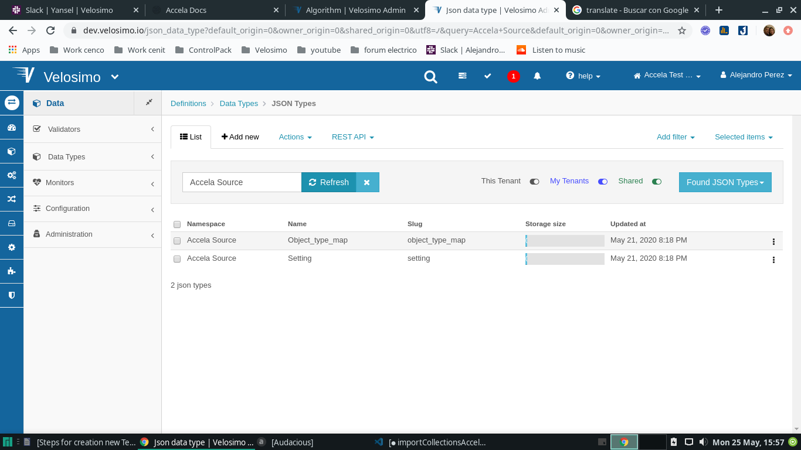
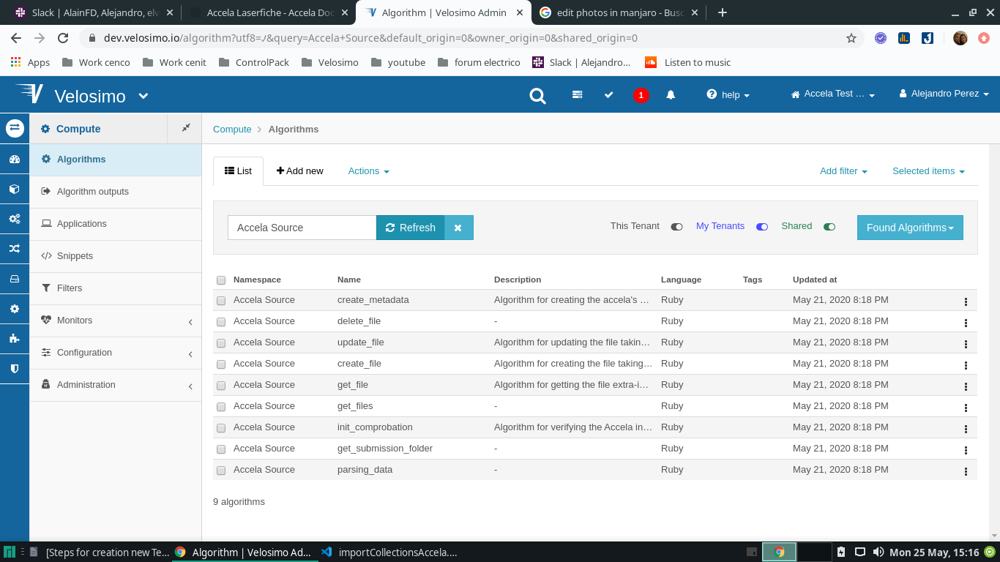

# Collections Accela

## Import Accela Source Collection

### Collections for App

• Import collection Accela Source for the new tenant (https://dev.velosimo.io/collection/pull_import)

### Regist Application for Adapter

• go to DashboardAuthorization ClientsOAuth ClientsApplicationsDoRecordv1 | Accela Adapter [App]Regist for create slug for adapter

• Insert slug and OuthName for new tenant

• Click on the register button and verify that the slug was inserted

### Create New Records for Object_type_map Data Types

• go to DefinitionsData TypesJSON Types and verify under the namespace Accela Source if exist Object_type_map Data Type

• create 9 new records for Data_type Object_type_maps of namespace “Accela Source”
https://dev.velosimo.io/accela_source~object_type_map with key and values

     key   value

1.  CAP -> Record
2.  LICENSEPROFESSIONAL -> Professional
3.  TMP_CAP -> Temp Record
4.  PARCEL -> Parcel
5.  INSPECTION -> Inspection
6.  PART -> Part
7.  EVIDENCE -> Evidence
8.  ASSET -> Asset
9.  ASSETCA -> Asset CA

### Verify Algorithms

• go to ComputeAlgorithms and verify under the namespace Accela Source if exist 9 algorithms

• go to ComputeAlgorithms and verify under the namespace doRecordv1 if exist algorithm get_setings, this is necesary for work with accela Adapter

#### Algorithm Get Settings

The main function of the gett_settings algorithm is to obtain and send to the adapter the elements necessary for its work, such as credentials, mapping, urls, etc., so it is important to verify if all the algorithms and data types used by this exist.

• go to DefinitionsData TypesJSON Types and verify under the namespace Accela Source if exist Settings Data Type , from it the initial information is obtained

### Verify Snippets

 

## Import Accela Storage Collection
