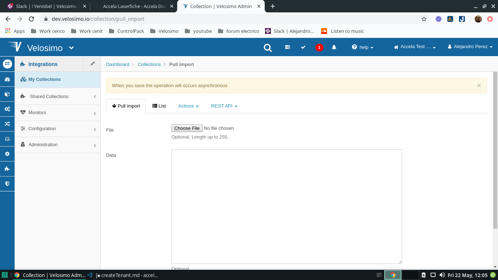
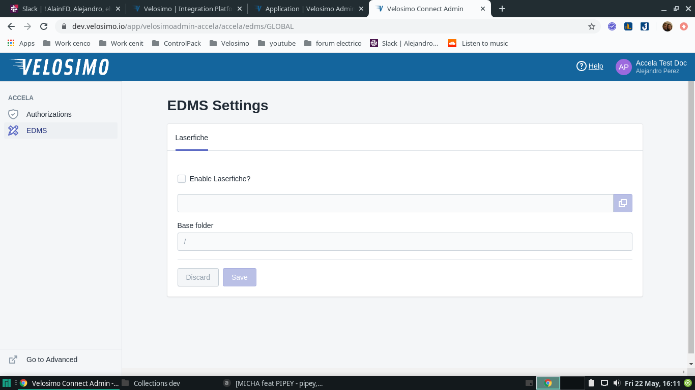
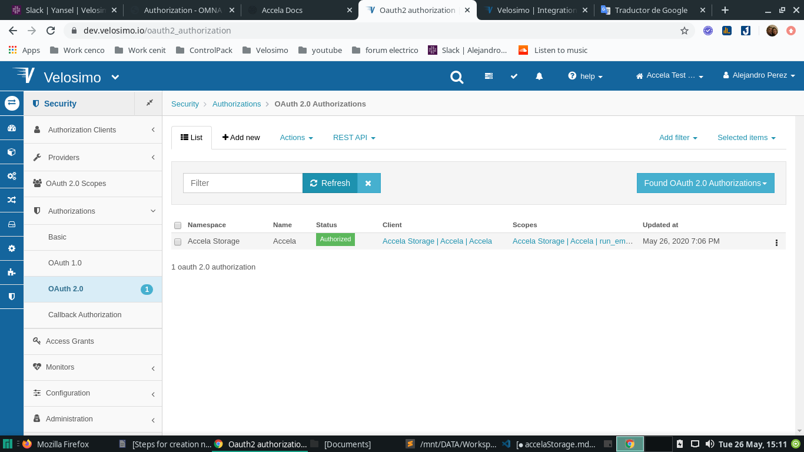
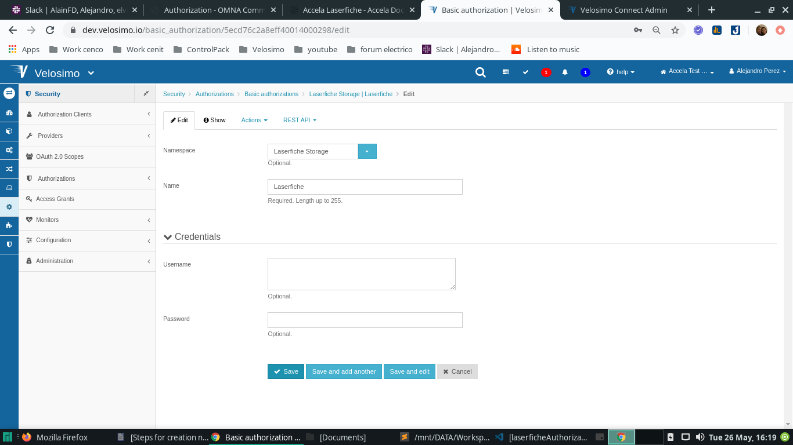

## Laserfiche

### Collections for App

- Import collection Integration Management Collection for the new tenant (https://dev.velosimo.io/collection/pull_import)



- go to **_Integrations Collections_** (https://dev.velosimo.io/collection) and verify under Title **_Laserfiche Storage_** if exist **_laserfiche storage_** name, if it does not exist, it must be created with the values written in the next point


- To verify the correct import of the collection go to the browser and paste the url of your new application, verifying that the image is similar to these



### Authorization

- go to **_Security Authorizations OAuth 2.0 AuthorizationsAccela Storage | Accela_** (https://dev.velosimo.io/setup~oauth2_authorization) and check if under namespace **_Laerfiche Storage_** exist the **_laserfiche_** name , if it does not exist, it must be created with the values written in the next point



- go to option **_SecurityAuthorizationsBasic authorizationsLaserfiche Storage | LaserficheEdit _** and verify the current values with this:

```
  "namespace": "Laserfiche Storage",
  "name": "Laserfiche"
```



### Connections

- go to option **_Connectors Connections_** (https://dev.velosimo.io/connection) and check if under namespace **_Laerfiche Storage_** exist the **_connection_** name, this connection must be created, if it does not exist, it must be created with the values written in the next point, for this go to **_Connectors Connections New_** (https://dev.velosimo.io/connection/new)

- go to option **_ConnectorsConnectionsAccela Storage | ConnectionEdit_** and verify the current values with this:

```
"namespace": "Laserfiche Storage",
"name": "Connection",
"authorization_handler": false,
"url": "http://{{api_url}}/laserfiche/api",
"authorization":
"namespace": "Laserfiche Storage",
"name": "Laserfiche"
"headers":
"key": "credentials",
"value": "{{credentials}}"

"template_parameters":
"key": "server",
"value": "http://laserfiche.velosimo.com"
"key": "repository",
"value": "velosimo"
"key": "license"
"key": "api_url",
"value": "connect.velosimo.com:3081"
```
